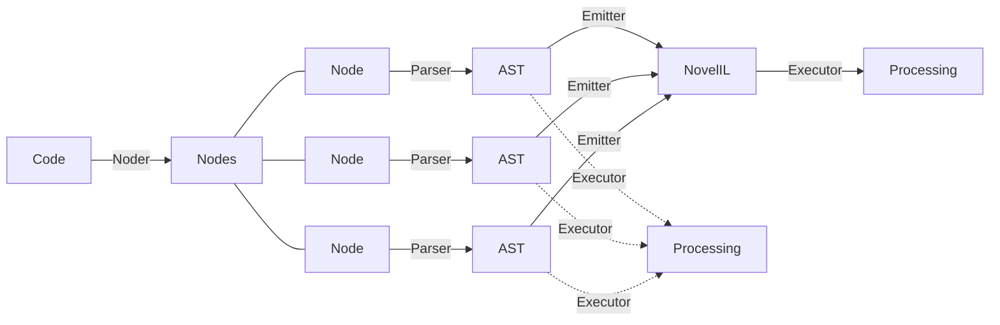

# CommonNovel Sample

## The way to process

1. Code → Nodes (Noder)
2. Node → AST (Parser)
3. AST → NovelIL (Emitter)[^out-of-support]

4. (AST → Processing)
5. (NovelIL → Processing)[^out-of-support]

[^out-of-support]: The functions are out of support at this repo. It will supported at NovelIL repo.



## Usage

WIP

<!--
```cs
using CommonNovel;

string[] nodes = Compiler.Noder(args[0]);
string[][] tokens = [];
// string[][][] result = [];

int i = 0;
foreach (string node in nodes)
{
    Array.Resize(ref tokens, i + 1);
    tokens[i] = Compiler.Parse(node);
    i++;
}

// AST([]);
```
-->
